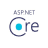
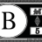

# MiniHub

O MiniHub é um sistema de gerenciamento de arquivos para empresas e projetos. Com ele, é possível criar, editar, compartilhar e excluir arquivos, além de gerenciar usuários, permissões e flags. Tudo isso na rede interna da sua empresa ou projeto.

## Principáis tecnologias utilizadas

### .Net
O .NET é uma plataforma de desenvolvedor multiplataforma de código aberto gratuita para criar muitos tipos diferentes de aplicativos. O ASP.NET amplia a plataforma de desenvolvedor do .NET com ferramentas e bibliotecas específicas para a criação de aplicativos web. O C# é sua principal linguagem de programação, simples, moderna, com foco no objeto e de tipo seguro. 

Bibliotecas utilizadas no desenvolvimento:

| [ASP.Net](https://www.nuget.org/packages/Microsoft.AspNetCore.OpenApi) | [Entity Framework](https://www.nuget.org/packages/Microsoft.EntityFrameworkCore) | [AutoMapper](https://www.nuget.org/packages/AutoMapper) | [Bogus](https://www.nuget.org/packages/Bogus) | [FluentValidation](https://www.nuget.org/packages/FluentValidation) | [Serilog](https://www.nuget.org/packages/Serilog) | [xunit](https://www.nuget.org/packages/xunit) | [JWT](https://www.nuget.org/packages/Microsoft.AspNetCore.Authentication.JwtBearer)
|:--:|:--:|:--:|:--:|:--:|:--:|:--:|:--:|
|  |  |  |  |  |  |  | 

### Next.js/React

Em construção...

## Principais Regras de Negócio

Usuários:

* Os Administradores e Supervisores podem visualizar todos os usuários;
* Os Administradores e Supervisores podem criar novos usuários;
* Um Usuário pode editar suas informações (nome, email, telefone, senha);
* Os Administradores podem deletar usuários;
* Os Administradores e Supervisores podem adicionar funções a um usuário;
* Os Administradores e Supervisores podem remover funções de um usuário;

Funções:

* Os Administradores e Supervisores podem visualizar todos os funções;
* Os Administradores e Supervisores podem criar novos funções;
* Os Administradores e Supervisores podem editar funções (nome);
* O Administrador pode deletar funções;

Flags:

* Um Colaborador pode visualizar flags;
* Um Colaborador pode criar flags;
* Um Colaborador pode editar flags (nome) que criou;
* Um Colaborador pode deletar flags que criou;

Diretórios:

* Um Colaborador pode visualizar diretórios que possuem seu cargo;
* Um Colaborador pode criar diretórios;
* Um Colaborador pode excluir diretórios que tenha criado;
* Um Colaborador pode adicionar funções a seus diretórios;
* Um Colaborador pode adicionar flags a seus diretórios;
* Um Colaborador pode compartilhar (link) de diretórios que possue acesso;

Arquivos:

* Um Colaborador pode visualizar arquivos que possuem seu cargo;
* Um Colaborador pode fazer upload de um arquivo;
* Um Colaborador pode baixar arquivos que possuem o seu cargo ou que criou;
* Um Colaborador pode adicionar funções a seus arquivos;
* Um Colaborador pode adicionar flags a seus arquivos;
* Um Colaborador pode compartilhar (link) de arquivos que possue acesso;

## Diagramas

Para modelar e representar a estrutura lógica dos dados, é utilizado o **Diagrama de Entidade-Relacionamento**, proporcionando uma visão clara e concisa das relações e da organização dos dados dentro do banco de dados.

Por fim, o projeto esta sobre a Clean Architecture, visando testabilidade, flexíveis e separação de responsabilidades. Essa abordagem de arquitetura de software promove a separação clara e distinta das responsabilidades em diferentes camadas, permitindo que cada uma delas evolua de forma independente.

## Showcase

### Api

